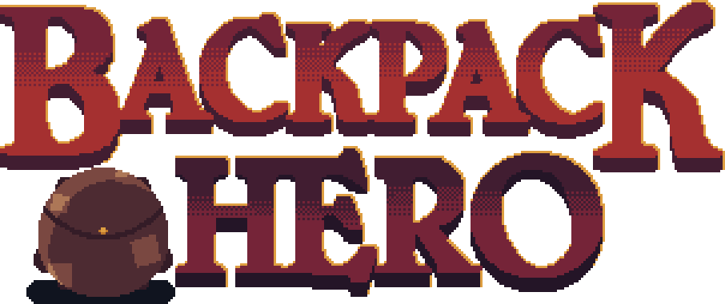
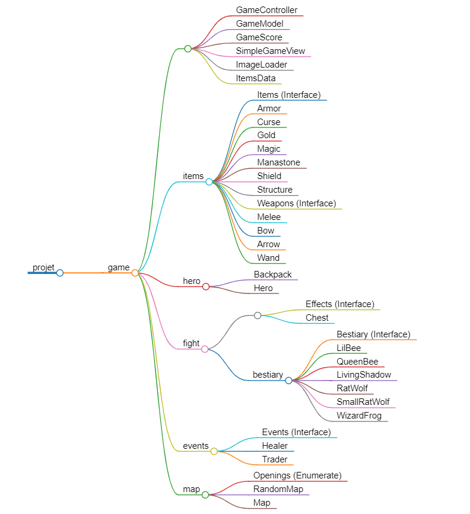
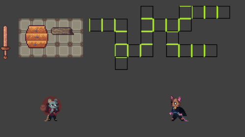
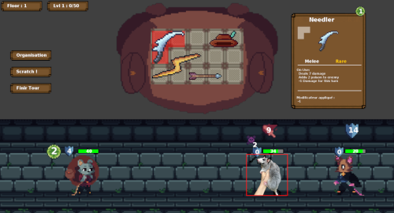

# Backpack Hero

    

🎒🐭 Jeu roguelike ! Partez à l'aventure avec votre sac à dos pour parcourir le donjon en abattant les monstres avec vos différents trésors !

## 📖 **Règles du jeu**
1. **Objectif** : Traverser les étages du donjon en affrontant les ennemis et en utilisant les objets de votre sac à dos.
2. **Déroulement** :
   - Déplacez-vous dans des pièces aléatoirement générées contenant des ennemis, des trésors, des marchands ou des guérisseurs.
   - Combattez vos adversaires en tour par tour.
   - Gagnez des objets, de l'or et de l'expérience pour progresser.
3. **Fin de partie** : 
   - Le jeu se termine après avoir complété le 3ᵉ étage. Si vous y parvenez, vous remportez la partie !

## 🛠️ **Fonctionnalités principales**

### 🌍 **Carte du niveau**
- Les étages sont composés de **5 x 11 cases**.
- Les pièces peuvent contenir :
  - Ennemis
  - Coffres
  - Marchands
  - Guérisseurs
- Chaque étage possède une porte de sortie.
- La génération des pièces et des événements est **aléatoire**.
- Certaines salles bloquent le passage, ajoutant un défi supplémentaire.

### ⚔️ **Système de combat**
- Combat **tour par tour** :
  - Le héros attaque en premier, puis c'est au tour des ennemis.
- Actions du héros :
  - Utiliser des objets du sac à dos pour attaquer, défendre ou appliquer des effets.
  - Effectuer une attaque de base "Scratch" sans objet.
- Ennemis :
  - 6 types d'adversaires avec des actions aléatoires (attaque, défense, etc.).
  - Les ennemis peuvent annoncer leurs intentions pour le tour suivant.
- Récompenses : objets, expérience, or.

### 🧙‍♂️ **Bestiaire**
- Types d'ennemis :
  - Petits rats-loups
  - Rats-loups
  - Petites abeilles
  - Reine abeille
  - Ombres vivantes
  - Grenouilles magiciennes

### 🎨 **Interface utilisateur**
- Informations affichées :
  - Points de vie, énergie et protection du héros.
  - Effets en combat.

### 🎒 **Sac à dos**
- **Gestion personnalisable** :
  - Ajoutez des cases en gagnant des niveaux d'expérience.
  - Positionnez et faites pivoter vos objets pour maximiser l'espace.
- Plus de **20 objets** :
  - Armes de mêlée, armes à distance, armures, boucliers, objets magiques, manastones et or.
- **Malédictions** :
  - Infligées par des ennemis. Vous pouvez :
    - Les accepter, occupant une place dans le sac à dos.
    - Les refuser, ce qui inflige des dégâts.

### 🏆 **Score**
- Calculé en fonction de :
  - La valeur des équipements dans le sac à dos.
  - Le nombre d'ennemis vaincus.
  - Les étages parcourus.
  - Les niveaux d'expérience atteints.
  - Les points de vie restants.
- Sauvegardé dans un fichier texte pour chaque partie.

---

## 🗂️ **Organisation du projet**
Voici le schéma UML illustrant la structure du projet et les relations entre les classes et les interfaces.

---

## 🎉 **Histoire du projet**
À une semaine du rendu, nous avons décidé de **tout recommencer de zéro** afin d'implémenter correctement le modèle **MVC**. Le soir de l'anniversaire de Kellian, nous avons créé un **Trello** pour organiser les tâches, et nous avons travaillé intensément pour obtenir un rendu final complet et fonctionnel.

Nous sommes très fiers du résultat obtenu : une note parfaite de **20/20** ! 🎉

## **Comparaison avant/après**
#### Rendu initial

#### Rendu final

## 🚀 **Comment lancer le jeu**
1. Installez un IDE et configurez le JDK **JavaSE-17**.
2. Clonez ce dépôt dans votre environnement local.
3. Lancez le fichier `GameController.java` via votre IDEE.
4. Profitez du jeu !

## 👥 **Contributeurs**
- **Hélèna CHEVALIER**
- **Kellian BREDEAU**
